# 🌐 Convofy-AI-Practice

**Convofy** is a responsive and secure web application that helps users practice new languages by connecting with others through **chat**, **video calls**, and **AI-powered English speaking practice**. Built with modern web technologies, Convofy enables a smooth user experience with real-time communication, personalized feedback, and dynamic UI themes.

## ✨ Key Features

### 🎙️ Practice Speaking with AI (only for English)

* Choose a **topic** from a curated list of categories.
* Speak freely while the app **records your voice using WebSockets**.
* Audio is transcribed using **AssemblyAI**, a powerful speech-to-text API.
* Transcript is evaluated using a **general-purpose language model** (e.g., GPT-4 or similar) for accurate language proficiency analysis (Used Deepseek).
* Receive a detailed **evaluation scorecard** for:

  * Fluency
  * Pronunciation
  * Grammar
  * Vocabulary
  * Overall Score
* Get **personalized suggestions** to improve your speaking skills.
* View your **test history** and track progress over time.

### 🔐 Authentication

Secure Sign Up and Login functionality using **JWT-based authentication** to protect user sessions and data.

### 💳 Premium Plans with Stripe

* Upgrade to **Premium** with secure payments via **Stripe**.
* Choose between:
  - **Monthly Plan**
  - **Annual Plan**
* Automatically update your account status post-payment.
* Handled using **Stripe Webhooks** for event-driven updates.


### 🏠 Home Page

* Discover **recommended users** based on shared interests
* View your list of **friends**
* **Send friend requests** to connect with others

### 🛎️ Notifications Page

* View **incoming friend requests**
* **Accept** or **reject** requests

### 👥 Friends Page

* View all your **accepted friends**
* **Start a chat** or **video call** directly from this list

### 💬 Chat

Real-time messaging with friends using **Stream Chat API**.

### 🎥 Video Calling

High-quality video calls using the **Stream Video API**.

### 🎨 UI Themes

Switch between **multiple themes** using **DaisyUI + Tailwind CSS**.

### 📱 Responsive Design

Optimized for **desktop, tablet, and mobile** platforms.

---

## 🛠️ Tech Stack

### **Frontend**

* [React](https://reactjs.org/) + [Vite](https://vitejs.dev/)
* [Tailwind CSS](https://tailwindcss.com/) + [DaisyUI](https://daisyui.com/)
* [Stream Chat & Video SDK](https://getstream.io/)

### **Backend**

* [Node.js](https://nodejs.org/) + [Express](https://expressjs.com/)
* [MongoDB](https://www.mongodb.com/) via Mongoose
* [Stripe](https://stripe.com/) for payment processing
* [AssemblyAI](https://www.assemblyai.com/) for real-time speech transcription
* LLM for transcript evaluation
* JWT-based authentication

---

## 🔧 Environment Variables

### 📦 Backend (`backend/.env`)

```
PORT=5001 #your port Number
MONGO_URI=your_mongo_uri

STEAM_API_KEY=your_steam_api_key
STEAM_API_SECRET=your_steam_api_secret

JWT_SECRET_KEY=your_jwt_secret

MODEL_API_KEY=your_model_api_key
MODEL_API_ENDPOINT=your_model_api_endpoint
MODEL_ID=model-id-or-name

STRIPE_SECRET_KEY=your_stripe_secret
STRIPE_WEBHOOK_SECRET=your_stripe_webhook_secret

STRIPE_MONTHLY_PRICE_ID=your_stripe_monthly_price_id
STRIPE_ANNUAL_PRICE_ID=your_stripe_annual_price_id

```

### 🌐 Frontend (`frontend/.env`)

```
VITE_STREAM_API_KEY=your_stream_key_here
VITE_API_BASE_URL=your_backend_url/api
```

---

## 🚀 Getting Started

### Prerequisites

* Node.js (v18 or higher)
* MongoDB Database
* Stream API Key and Secret
* Access to GPT model
* stripe 
* Assembly AI API

### 📥 Installation

1. **Clone the Repository**

```bash
git clone https://github.com/GlenFonceca/convofy-ai-practice.git
cd convofy-ai-practice
```

---

### ⚙️ Backend Setup (Node + Python + Vosk)

```bash
cd backend
npm install
```

2. **Configure Environment Variables**
   Create `.env` inside `backend/` and paste the required values.

3. **Start Backend Server**

```bash
npm start
```

---

### 💻 Frontend Setup

```bash
cd frontend
npm install
```

5. **Configure Environment Variables**
   Create `.env` inside `frontend/` and paste the required values.

6. **Start Frontend Server**

```bash
npm run dev
```

---

## 📸 Screenshots


<p align="center">
  <b>Home Theme 1</b>
</p>
<p align="center">
  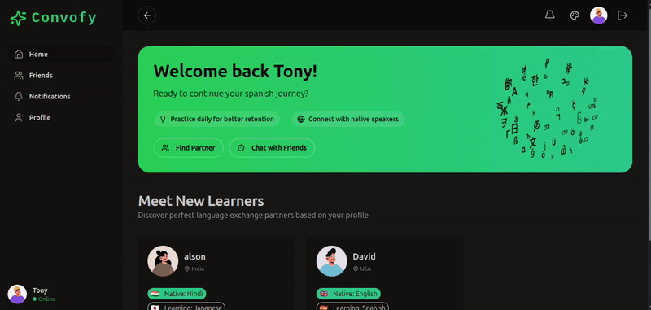
</p>
  
<p align="center">
  <b>Home Theme 2</b>
</p>
<p align="center">
  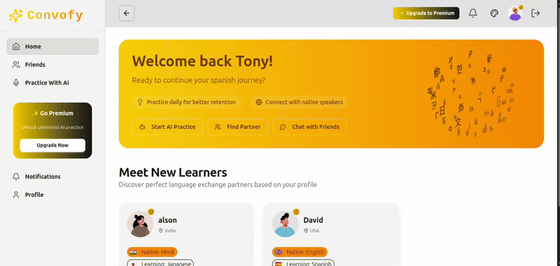
</p>
  


<p align="center">
  <b>Login Page</b> 
  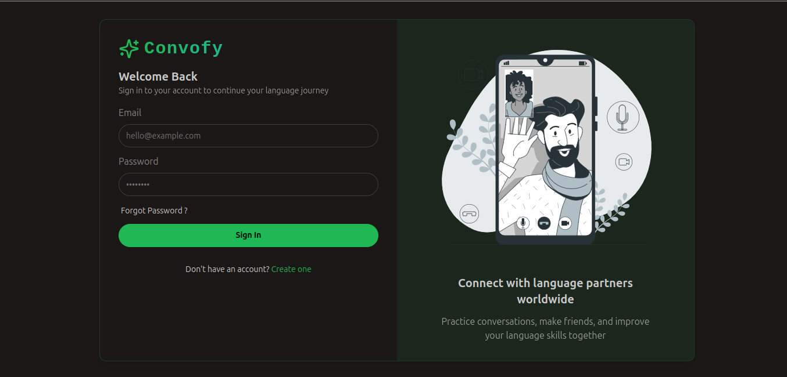
</p>

<p align="center">
  <b>Practice with AI</b> 
  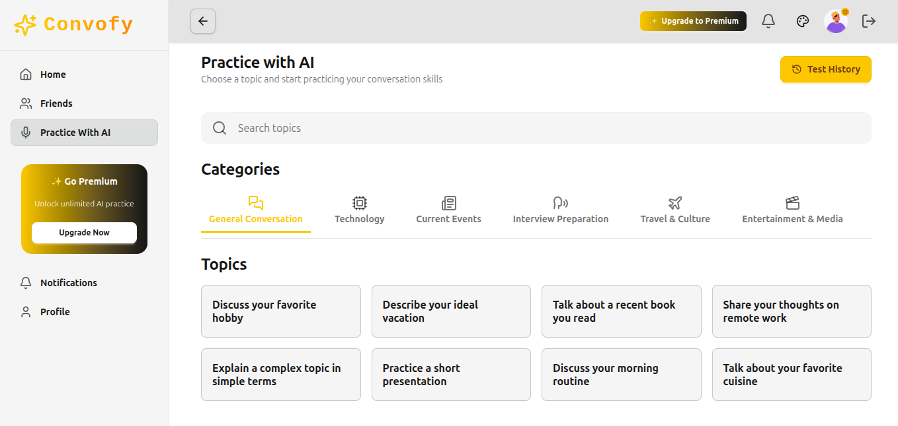
  <b>Check Previous Tests</b>
  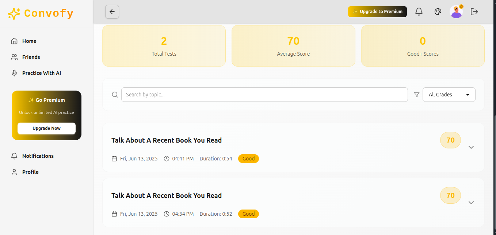
  <b> Take Test </b>
  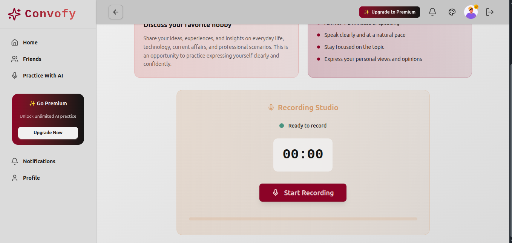
</p>

<p align="center">
  <b>Upgrade to Premium</b>
  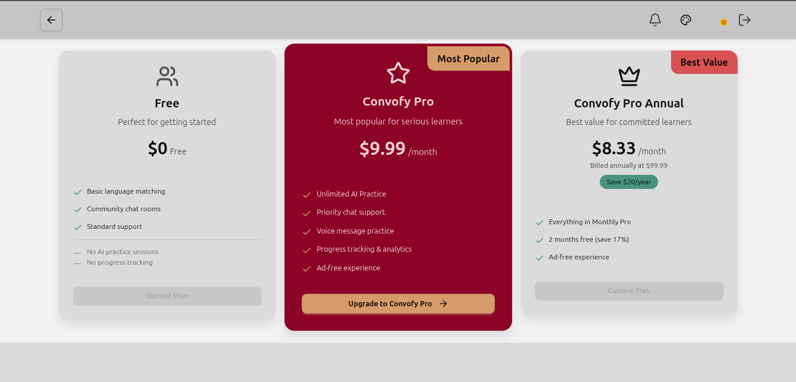
</p>


<p align="center">
  <b>Profile</b> 
  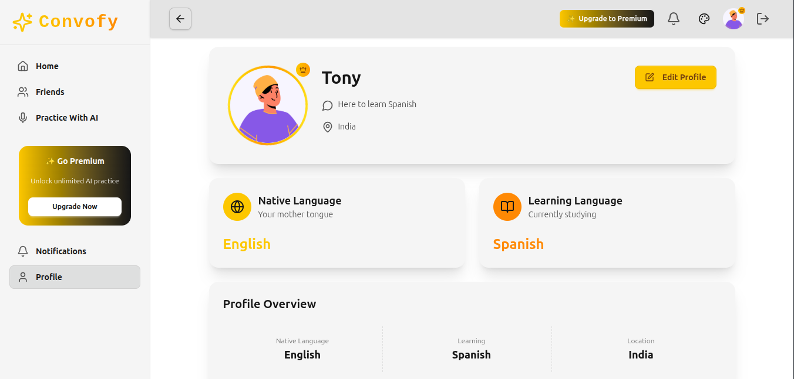
  <b>Friends</b>
  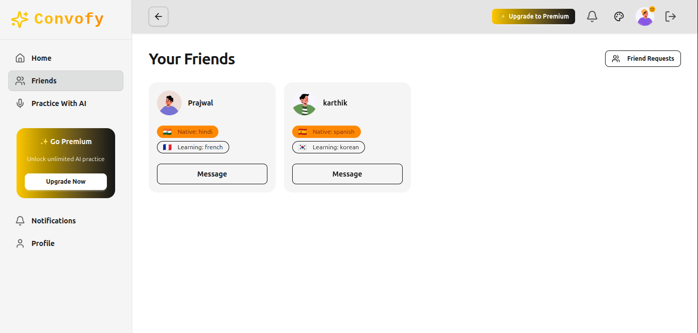
  <b>Notifications</b>
  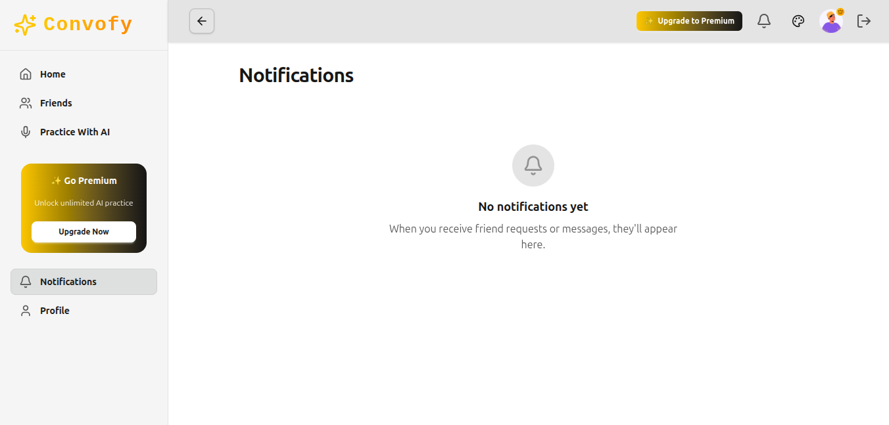
</p>

<p align="center">
  <b>Chat</b>
  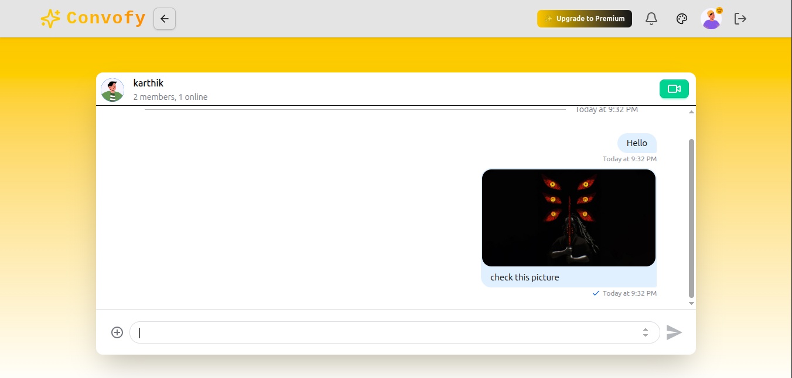
  <b>Video Call</b>
  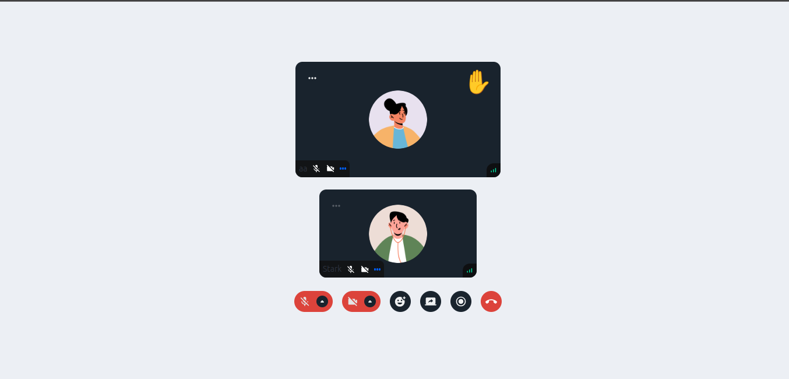
</p>

---

## 🧩 Future Improvements

* Multilingual support for speaking practice
* Support for emotion/tone analysis
* Gamification elements and rewards

---

## 🤝 Contributing

We welcome all contributions to improve this AI-based speaking practice app. Feel free to fork the repo, raise issues, and submit pull requests.

---

## 🌟 Thank You!

Thank you for checking out **Convofy-AI-Practice**!
If this project helps you or someone learning English, please ⭐ the repository and share it!
